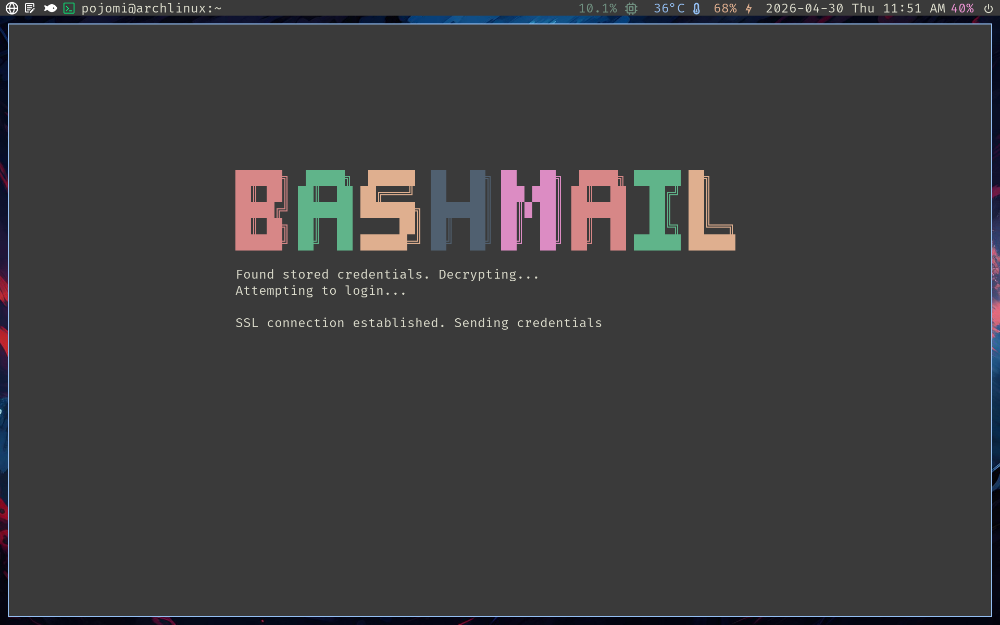
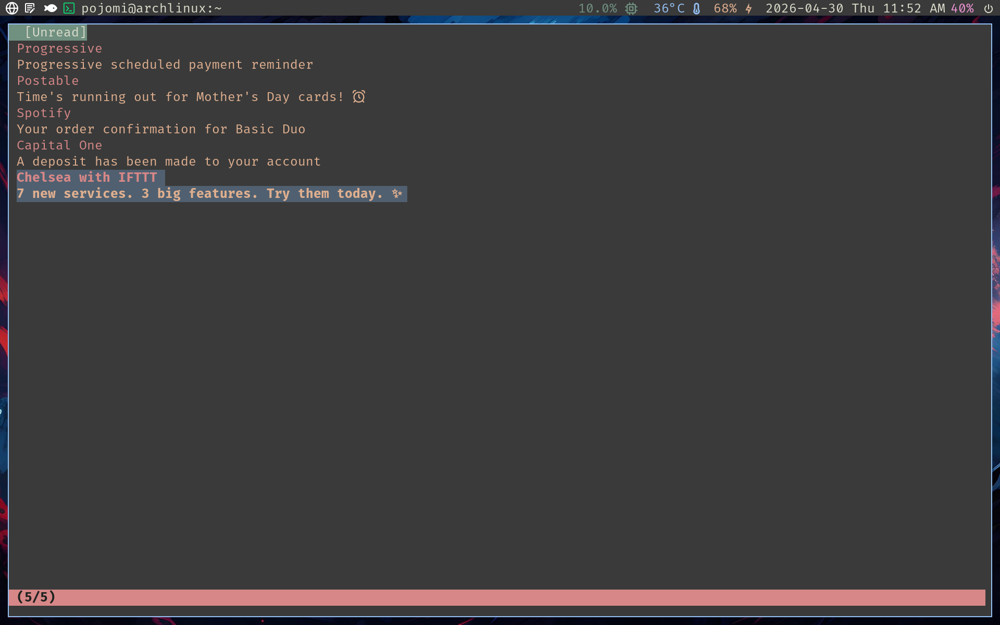
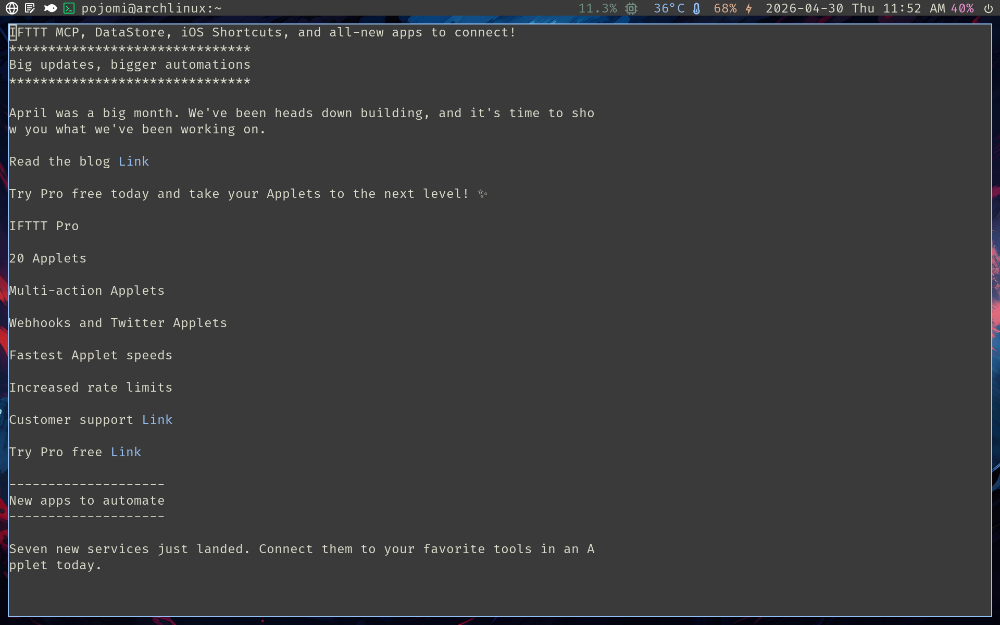

# bashmail
`bashmail` is a terminal based IMAP client with a TUI inspired by programs like fff and bashtop.

# Dependencies
- bash 4.0+
- openssl
# Installation
With `make`:
```
git clone https://github.com/pojomi/bashmail.git
make install
```
Without `make`:
```
git clone https://github.com/pojomi/bashmail.git
# Add to bin
sudo cp bashmail /usr/bin/bashmail
```
Then, just send `bashmail` in the terminal to launch.
# Usage
> [!CAUTION]
> This has only been tested with Gmail/icloud accounts and is not guaranteed to function the same way with other IMAP servers.

On initial launch, an email and password will be requested. These are encrypted and stored using `openssl`. They will be retrieved for future sessions automatically.

If you need to modify these credentials you can remove them with
```
rm ~/.config/bashmail/.emailenc ~/.config/bashmail/.passenc
```
and will be prompted to login again on relaunch.

> [!NOTE]
> Gmail/icloud Only if you have 2FA enabled, you must create an app password and use that in place of your normal password. [Google App Password](https://myaccount.google.com/apppasswords) [Apple App-Specific Password](https://support.apple.com/en-us/102654)

On successful login, unread messages will be fetched. Once retrieved, a list will be printed to the screen.

Each message in the "Unread" tab is made up of two lines in the format of:
- Sender
- Subject

> [!NOTE]
> During early stages of release, opening any message will **not** mark the message as read.  This will be removed eventually, but makes testing much more convenient.

The focused message will be highlighted. Pressing `return`/`enter` on a highlighted message will attempt to retrieve the text contents. All key bindings are listed below.

> [!NOTE]
> HTML messages are not supported at this time. When retrieving a message that is described as HTML, a warning popup will appear and not load the message.

Supported/tested message types include:
- Text/Plain
- Quoted-Printable
- Base64 encoded

In most cases, hyperlinks are replaced with "Link" written in your terminal's blue foreground color. These are **not** interactive links.
## Key Bindings
| Unread Tab        |                                             |
|:------------------|:--------------------------------------------|
| Key               | Action                                      |
| `q`               | Quit                                        |
| `^C`              | Quit                                        |
| `return or enter` | Open hovered message                        |
| `TAB`             | Switch to Inbox Tab                         |
| `j or ^N`         | Hover next message in list                  |
| `k or ^P`         | Hover previous message in list              |
| `r`               | Reload unread messages                      |
| `m`               | Mark hovered message for deletion/archiving |
| `d`               | Delete all marked messages                  |
| `a`               | Archive all marked messages                 |

| Inbox Tab         |                                             |
|:------------------|:--------------------------------------------|
| Key               | Action                                      |
| `q`               | Return to unread tab                        |
| `^C`              | Quit                                        |
| `return or enter` | Open hovered message                        |
| `TAB`             | Switch to Unread Tab                        |
| `j or ^N`         | Hover next message in list                  |
| `k or ^P`         | Hover previous message in list              |
| `m`               | Mark hovered message for deletion/archiving |
| `d`               | Delete all marked messages                  |
| `a`               | Archive all marked messages                 |

| Viewing Message |                                |
|:----------------|:-------------------------------|
| Key             | Action                         |
| `h or ^B`       | Move cursor back one column    |
| `j or ^N`       | Move cursor forward one line   |
| `k or ^P`       | Move cursor backward one line  |
| `l or ^F`       | Move cursor forward one column |
| `f`             | Move forward one full page     |
| `b`             | Move backward one full page    |
# Other Useful Information
`bashmail` uses your terminal's default color specifications. Appearance will vary for every user.
# Known Issues
- Some messages will return with little to no text after all the parsing is finished
- QP messages sometimes have leftover `)` after parsing hyperlinks
# Roadmap
Completed tasks will be rewritten with strikethrough style when completed. New tasks may be added. The list below is in planned order of completion.

- ~~Fix marked message ID tracking being passed to archive/delete commands~~
- ~~Add preview screenshots to README~~
- ~~Archive/delete support for unread tab~~
- ~~"Inbox" tab to view all messages in new-old sorting~~
- ~~Paging for unread/inbox tabs~~
- ~~Add archive/delete for inbox tab~~
- Dynamic tracking window resize
- Receive date to entries
- Add maximum allowable size to messages retrieved from IMAP server
- SMTP support to allow replying with plain text
- Cleanup message formatting as new bugs appear
- HTML support (maybe external launch in browser)

